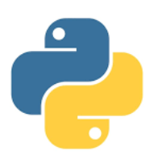
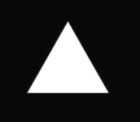
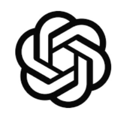
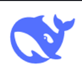
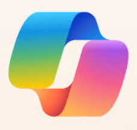
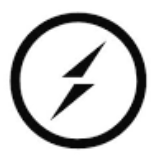
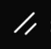
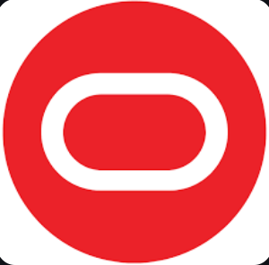
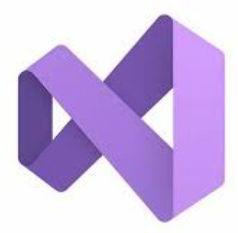
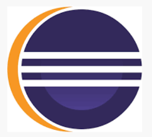

<h1 align="center" style="color: #0e75b6;">
   "Joey Aibert U. Collado" 
</h1>

<h3 align="center" style="color: #1c6e8c;">
  💻 Full-Stack Web Developer | 💻 Skilled Front-End Developer
</h3>

  

  

  

  

## 🌟 About Me

- I am a self-taught programmer actively pursuing Full-Stack Web Development using a variety of useful technologies and always eager to learn new powerful technologies that can help me create more powerful websites. I started programming at 18 years old and quickly got into it because I find it really fun, which led me to make a career out of it. I create personal projects in my free time and also do freelancing when available. Programming for me is a journey, and I don't ever see myself quitting this journey. Working with like-minded people is a joy, and if you wish to create something with me, we can make it happen.
  
- 📫 **Reach Out**: [akosijoeyaibertcollado@gmail.com](mailto:akosijoeyaibertcollado@gmail.com)

  

  <picture>
    <source media="(prefers-color-scheme: dark)" srcset="https://raw.githubusercontent.com/tobiasmeyhoefer/tobiasmeyhoefer/output/github-snake-dark.svg" />
    <source media="(prefers-color-scheme: light)" srcset="https://raw.githubusercontent.com/tobiasmeyhoefer/tobiasmeyhoefer/output/github-snake.svg" />
    
  </picture>

  

## 🌐 Connect with Me

  
  
  

  

## 🛠️ Tech Stacks

  
  
  
  
  
  
  
  
  
  
  
  
  
  
  
  
  
  
  
  
  
  
  
  
  
  
  
  
  
  
  
  
  
  
  
  
  

  

## 🌟 Fun Facts & Achievements
✨ **Fun Facts**:
- I enjoy contributing to open-source projects to support the tech community.
- I love creating fully functional websites with nice and clean UIs.
- I actively learn new trends in full-stack web development.

🏆 **Achievements**:
- **Top Contributor** to several GitHub repositories.
- Built and deployed a web app used by many users.
- Won several hackathon competitions, with my highest place being the champion.

  

## 📊 GitHub Stats

  

  

  

  ✨ Thank you for visiting my profile! If you like what you see, let's connect and create something together! 😊

  

  

  

  ✨ Thank you for visiting my profile! If you like what you see, let's connect and create something together! 😊

